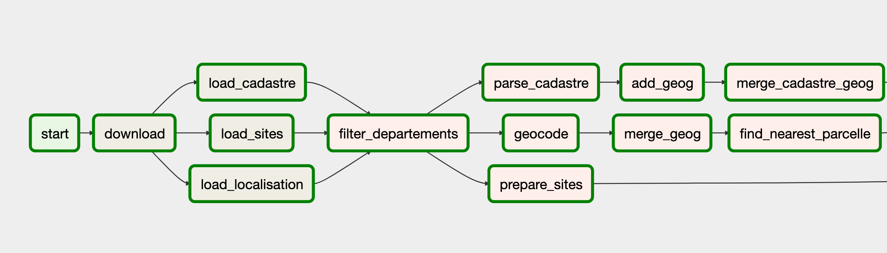

# kelrisks-data-preparation

Pipelines de préparation des données (cadastre, BASOL, BASIAS, SIS et S3IC) pour l'application
Kelrisks

## Le projet

Kelrisks est une startup d'état du MTES qui permet d'évaluer simplement et rapidement le risque
de pollution d'un terrain.

* [Site web](https://kelrisks.beta.gouv.fr/#/)
* [Github du site web](https://github.com/MTES-MCT/kelrisks)

## Les données

### Source de données

On utilise les bases de données suivantes:

* **SIS** (Les secteurs d'information des sols)
* **BASOL** (Sites et sols pollués (SSP) ou potentiellement pollués appelant une action des pouvoirs publics, à titre préventif ou curatif)
* **S3IC** (base des installations classées pour la protection de l'environnement)
* **BASIAS** (Inventaire historique des sites industriels et activités de service)

Ces données sont disponibles en téléchargement partielle sur les sites suivants:
* [Géorisques](https://www.georisques.gouv.fr/) (SIS, BASIAS, S3IC)
* [installationsclassees.developpement-durable.gouv.fr](http://www.installationsclassees.developpement-durable.gouv.fr/) (S3IC)
* [basol.developpement-durable.gouv.fr](https://basol.developpement-durable.gouv.fr/) (Basol)


Les fichiers en téléchargement ne contiennent pas toutes les informations. Le BRGM nous a
donné accès à des dumps plus complets. Ces dumps contiennent plus ou moins les mêmes
informations que celles contenues dans les pages détails dont on trouvera un
exemple ci-dessous pour chaque base

* [Page détail SIS](http://fiches-risques.brgm.fr/georisques/sis/91SIS00032)
* [Page détail Basol](https://basol.developpement-durable.gouv.fr/fiche.php?page=1&index_sp=07.0005)
* [Page détail Basias](http://fiches-risques.brgm.fr/georisques/basias-detaillee/IDF9100001)
* [Page détail S3IC](http://www.installationsclassees.developpement-durable.gouv.fr/rechercheIC.php?selectRegion=&selectDept=-1&champcommune=&champNomEtabl=&champActivitePrinc=-1&selectRegEtab=-1&champListeIC=&selectPrioriteNat=-1&selectRegSeveso=-1&selectIPPC=-1#)

### Qualité des données

La capacité de Kelrisks à délivrer son service dépend de la qualité des données.
Plusieurs problèmes ont été identifiés qui rendent l'exploitation de ces données difficiles:

#### Existence et précision du géo-référencement

De nombreux sites ne sont pas géoréférencés précisement ou au "centroïde commune".
Par ailleurs, certains enregistrement possèdent des informations de parcelles cadastrales mais dans un format texte difficilement exploitable (ex: "AH 575-574-43-224"). Il existe également des sites pour lesquels on a plusieurs informations géographiques contradictoires.

#### Format hétérogène

Le format des données entre les différentes bases est hétérogène. Par exemple les données géographiques SIS représentent des multi-polygones, d'autres font référence à des points mais avec des SRID qui peuvent être différents (Lambert93, Lambert2, WGS84, etc). Par ailleurs les concepts de précision des données (*parcelle*, *adresse*, *centroïde commune*) ne sont pas les mêmes entre les bases. Il est donc nécessaire de les normaliser.

#### Correspondance adresse <> parcelle

Les avis Kelrisks sont rendus sur des parcelles.
Le problème est que la correspondance adresse <> parcelle n'est pas direct. Plusieurs  parcelles peuvent se trouver à la même adresse, une même parcelle peut se retrouver sur plusieurs adresses, les parcelles sont fusionnées ou découpées dans le temps. Or le site Kelrisks propos une recherche à double entrée: par *parcelle* et *par adresse*. Lors d'une recherche par adresse, on est obligé de faire une projection sur la parcelle la plus proche, ce qui peut conduire à des faux négatifs. On veut avoir un match si l'utilisateur cherche une adresse (par exemple *4 boulevard Longchamp Marseille*) et qu'un enregistrement possède une adresse similaire en base modulo de petites variations (par exemple *4 bd. Longchamp 13001 Marseille*). Cela nécessite de faire une comparaison textuelle "floue".


### Volumétrie des données cadastrales

Pour un déploiement France entière l'intégralité des [données du cadastre](https://cadastre.data.gouv.fr/) doit être chargée en base. Cela représente environ
100 millions d'enregistrements (~ 40 Go dans une table Postgres). Les bons indexs devront être crées pour:

* avoir des résultats en temps réel aux requêtes
de l'utilisateur sur le site
* accélérer les étapes de préparation des données qui nécessite de faire une jointure avec la table cadastre. Par exemple lorsqu'on projette les points des sites BASIAS sur la parcelle la plus proche, on fait une jointure géographique de cardinal (250 000 x 100 000 000)

Il faudra également faire attention à la consommation de la mémoire lors du chargement des données du cadastre.

## Solution et résulats

### Traitement

Plusieurs types de traitements sont effectués pour
améliorer la qualité des données

* géocodage en masse des adresses à l'aide de l'API [adresse.data.gouv.fr](https://adresse.data.gouv.fr/). Une librairie cliente en Python a été développée pour faciliter ce travail: [bulk-geocoding-python-client](https://github.com/MTES-MCT/bulk-geocoding-python-client).
* Stockage de l' `adresse_id`renvoyé par `adresse.data.gouv.fr`. Cela permet lors d'une recherche par adresse de comparer l'`adresse_id` de la recherche avec les `adresse_id` des sites et donc d'implémenter une recherche "floue" textuelle à moindre frais (le travail est déléguée à `adresse.data.gouv.fr`).
* Nettoyage et extraction des informations de parcelles
* Projection des points sur la parcelle la plus proche
* Normalisation du format de données

### Format des données finales

Les tables finales contiennent toutes les champs suivants:

* `adresse_id`: identifiant unique de l'adresse géocodée renvoyée par `adresse.data.gouv.fr`
* `geog`: champs géographique de type `MULTIPOLYGON` représentant une ou
plusieurs parcelles ou éventuellement le contour d'une commune
* `geog_precision`: précision de l'information géographique. Peut prendre les valeurs suivantes:
  * `parcel` : précision à la parcelle
  * `housenumber`: précision au numéro de rue (une projection est effectuée sur la parcelle la plus proche)
  * `municipality`: précision à la commune. Dans ce cas le champ `geog` représente le contour de la commune
* `geog_source`: origine de l'information géographqique retenue (Cf nécessité de fusionner l'info quand plusieurs infos contradictoires). La valeur de ce champ dépend de la base concernée, on retrouvera notamment la valeur `geocodage` lorsque l'information provient du géocodage d'une adresse.

### Résultats

Les résultats relatifs à l' "amélioration" de la qualité des données sont publiés dans le fichier [qualite.md](./qualite.md)

## Pile logiciel

### Liste des composants principaux

* Docker
* Postgres
* [Apache Airflow](https://airflow.apache.org/)
* [data-preparation-plugin](https://github.com/MTES-MCT/data-preparation-plugin)
* [Embulk](https://www.embulk.org)

### Airflow

Airflow est une plateforme permettant de créer des workflows de préparation des données en séparant chaque étape dans différentes tâches. À chaque étape des tables intermédiaires sont crées et peuvent être inspectées. On peut utiliser des recettes SQL, Python ou Bash.

Ci-dessous une partie du worflow Basias en exemple.



L'utilisation d'Airflow permet en outre de faire tourner et de gérer le parallélisme de tâches qui prennent du temps comme le chargement des données du cadastre.

Le visionnage de la vidéo [Beyond Jupyter Notebooks](https://www.youtube.com/watch?v=bl1XSZy11vQ) permet de comprendre la nécessité d'avoir recours à Airflow.


## Développement


### Prérequis

Vous devez avoir `docker` et `docker-compose` installés sur votre machine


### Mise en route

Le projet utilise `docker-compose` pour builder et démarrer les services. Deux fichiers compose
de dev sont possibles:

* `docker-compose.dev.airflow-only.yml`: permet de créer un serveur Airflow seul dans le cas où vous voulez utiliser une base Postgres existante qui tourne sur localhost (Mac et Windows seulement). Dans ce cas il est nécessaire de créer dans Postgres un utilisateur et une base de données `airflow` ainsi que le schéma `etl` dans la base de données `kelrisks`. Voir [ce script](./postgis/scripts/init-db.sh) pour référence.
* `docker-compose.dev.yml`: permet de créer un serveur Airflow *ET* une base de données Postgis.

Le projet est configuré par un fichier `.env` situé à la racine.
Ce fichier n'est pas versionné dans git car il dépend de chaque installation et expose des informations de sécurité. Vous devez le créer et le renseigner en prenant le fichier `.env.model` pour modèle.

Une fois le fichier `.env` renseigné, vous pouvez builder et démarrer les services:

```
docker-compose -f docker-compose.dev.yml build
docker-compose -f docker-compose.dev.yml up
```

ou

```
docker-compose -f docker-compose.dev.airflow-only.yml build
docker-compose -f docker-compose.dev.airflow-only.yml
```

Visiter l'url `http://localhost:8080`, vous devez voir l'interface d'admin d'Airflow avec différents pipelines de données:

* prepare_cadastre
* prepare_commune
* prepare_basias
* prepare_basol
* ...

Cliquer sur pipeline, par exemple `prepare_commune` puis cliquer sur `Trigger Dag` pour lancer le worflow.


### Config

Les différentes valeurs du fichier de config sont documentées dans le fichier  [.env.model](.env.model). En local, il faut bien faire attention à configurer la valeur `DEPARTEMENTS` sur un ou deux départements seulement pour ne pas se retrouver à charger les données du cadastre de toute la France.

### Pipelines (DAGs)

#### Liste des pipelines
En langage Airflow, un pipeline est un DAG (direct acyclic graph). Les pipelines suivants
ont été définis:

* `prepare_commune` : permet de charger les contours géographiques des communes
* `prepare_cadastre` : permet de charger les données du cadastre
* `prepare_sis`: permet de charger et préparer les données SIS
* `prepare_s3ic`: permet de charger et préparer les données S3IC
* `prepare_basol`: permet de charger et préparer les données BASOL
* `prepare_basias`: permet de charger et préparer les données BASIAS
* `prepare_code_postal`: permet de charger une table de correspondance Code Insee / Code postal
* `deploy_cadastre`: permet de copier la table cadastre du schéma `etl` vers le schéma `kelrisks` (utilisé par le backend du site)
* `deploy`: permet de copier toutes les autres tables du schéma `etl` vers le schma `kelrisks` (utilisé par le backend du site)

#### Ordre d'exécution des pipelines
L'ordre d'exécution des pipelines (DAGs) est important car certaines tâches nécessitent la
présence de tables générées dans d'autres pipelines. Typiquement on s'assurera de faire tourner
les pipelines dans cet ordre:

* `prepare_commune`
* `prepare_cadastre`
* `deploy_cadastre`

puis dans n'importe quel ordre et en parallèle

* `prepare_sis`
* `prepare_s3ic`
* `prepare_basol`
* `prepare_basias`
* `prepare_code_postal`

puis

* `deploy`

Voir [espace disque](###Espace-disque) pour comprendre pourquoi on déploie le cadastre avant de préparer les autres données


### Lancement de tâches indépendantes

Il est possible de tester une tâche spécifique en se loggant au container `airflow`

```
docker exec -it $(docker ps -qf "name=airflow") bash
```

puis

```
airflow test {dag_name} {task_name} {date}
```

Par exemple pour lancer le chargement des données SIS dans la table source

```
airflow test prepare_sis load 20191205
```

Sur Linux ou MacOs vous pouvez utiliser le script `./airflow.sh` pour ne pas avoir à vous logguer au container:

```
./airflow.sh test prepare_sis load 20191205
```

### Faire tourner les tests unitaires

Pour faire tourner les tests, il faut se logguer au container airflow

```
docker exec -it $(docker ps -qf "name=airflow") bash
```

puis

```
cd dags
python -m unittest
```


## Déploiement en préprod et prod

### Serveur

Le service est déployé sur le même VPS que le site kelrisks (51.254.32.174)

### Environnement

Il existe deux environnements: preprod et prod.
La preprod est synchronisée avec la branche `dev` et la prod
est synchronisée avec la branche `master`. Il existe un fichier
de configuration `.env` différents pour chacun des environnements

* preprod `/srv/kelrisks-data-preparation/dev/.env`
* prod `/srv/kelrisks-data-prepation/master/.env`

### CircleCI

On utilise CircleCI pour builder les images Docker et télécharger
automatiquement les fichiers `docker-compose.yml`. Le worflow
CI est déclenché dès que l'on pousse sur la branche `dev` (preprod)
ou la branche `master` (prod).

Un utilisateur dédié `circleci` a été crée sur le serveur pour donner
accès à CircleCI en SSH.

Les images Docker sont poussées sur le DockerHub beta.gouv
[kelrisks-airflow](https://hub.docker.com/r/betagouv/kelrisks-airflow).
Le compte DockerHub de Benoît Guigal est utilisé mais il est possible de demander
accès à l'organisation beta.gouv sur Dockerhub dans le channel #incubateur-ops

### Administration

Par économie de mémoire sur le serveur qui n'est pas très puissant, on veillera
à ne jamais faire tourner la preprod et la prod en même temps. De même on veillera
à couper airflow lorsque les différents worflows sont terminés.


```
# En étant loggué avec l'utilisateur circleci ou root

# Démarrer airflow en preprod
cd /srv/kelrisks-data-preparation/dev
docker-compose up -d

# Démarrer airflow en prod
cd /srv/kelrisks-data-preparation/master
docker-compose up -d

# Stopper airflow en preprod
cd /srv/kelrisks-data-preparation/dev
docker-compose down

# Stopper airflow en prod
cd /srv/kelrisks-data-preparation/dev
docker-compose down
```


### Sécurité

On veillera à ne pas donner accès au serveur Airflow en dehors de localhost
en configurant la variable `AIRFLOW__WEBSERVER__WEB_SERVER_HOST=127.0.0.1`
dans le fichier `.env`.

L'accès au serveur airflow se fait en mettant en place un tunnel ssh.


### Espace disque

On ne dispose pas de suffisament d'espace disque pour faire cohabiter
les quatres tables:
* preprod `etl.cadastre`
* preprod `kelrisks.cadastre`
* prod `etl.cadastre`
* prod `kelrisks.cadastre`

Une manière de contourner le problème est de faire tourner `prepare_cadastre`
puis `deploy_cadastre` puis de supprimer la table `etl.cadastre`.

Les jointures avec la table cadastre effectués dans `prepare_s3ic`,
`prepare_sis`, etc sont configurées pour utiliser la table `kelrisks.cadastre`.

Se faisant, on s'assure d'avoir au maximum 3 tables cadastre qui cohabitent au maxiumum.

### Création des indexs de la table cadastre

La table cadastre nécessite la création de deux indexs en plus de l'index gis:

* Un index sur les champs (`commune`, `prefixe`, `section`, `numero`)
* Un index sur le champ `code`

La création de ces indexs est inclus dans le pipeline `prepare_cadastre`
mais le code est commentée pour l'instant car rencontre une erreur airflow
pour une raison inconnue. Il est donc nécessaire de créer ces indexs à
la main (attention ça peut prendre un peu de temps) grâce aux scripts
situés dans

* preprod  `/srv/kelrisks-data-preparation/dev/scripts`
* prod `/srv/kelrisks-data-preparation/master/scripts`


```
# preprod

cd /srv/kelrisks-data-preparation/dev/scripts

./create_cadastre_code_idx.sh > create_cadastre_code_idx.log 2>&1 &
./create_cadastre_commune_prefixe_section_numero_idx.sh > create_cadastre_commune_prefixe_section_numero_idx.log 2>&1 &

# prod

cd /srv/kelrisks-data-preparation/master/scripts

./create_cadastre_code_idx.sh > create_cadastre_code_idx.log 2>&1 &
./create_cadastre_commune_prefixe_section_numero_idx.sh > create_cadastre_commune_prefixe_section_numero_idx.log 2>&1 &
```

### Mémoire

Le fonctionnement actuel de chargement des données cadastre à l'aide d'une recette Python implique de charger en mémoire des geojson volumineux. Cela ne posait pas trop de soucis sur un seveur ad hoc mis en place par Benoît Guigal mais commence à poser des problèmes lorsqu'on fait tourner le pipeline sur le même serveur que le site Kelrisks. Pour éviter d'avoir des problèmes de mémoire on s'assurera de configurer Aiflow pour ne pas faire tourner de tâches en parallèle avec `AIRFLOW__CORE__DAG_CONCURRENCY=1`. Cette valeur pourra être augmentée pour accélérer le chargement des données après avoir analysé l'évolution de la mémoire du serveur pour un chargement entier des données du cadastre.

Par mesure de sécurité, 4G du swap ont été ajouté au serveur. On peut vérifier cette valeur en faisant

```
free -m
```

Le swap est rendu permanent en ajoutant une ligne au fichier `/etc/fstab`

## License

[GNU General Public License v3.0](./LICENSE)


