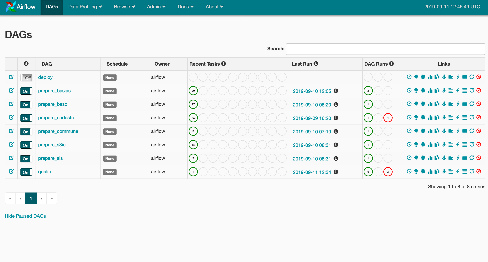

# kelrisks-data-preparation

Pipeline de préparation des données BASOL, BASIAS, SIS et S3IC pour l'application
Kelrisks

## Pile logiciel

* Docker
* Postgres
* [Apache Airflow](https://airflow.apache.org/)
* [data-preparation-plugin](https://github.com/MTES-MCT/data-preparation-plugin)
* [Embulk](https://www.embulk.org)


## Démarrage

Renseigner le fichier `.env` puis

```
docker-compose up
```

Visiter l'url `http://localhost:8080`, vous devez voir l'interface d'admin d'Airflow
avec différents pipelines de données:

* prepare_cadastre
* prepare_commune
* prepare_basias
* prepare_basol
* prepare_s3ic
* prepare_sis
* deploy
* qualite




